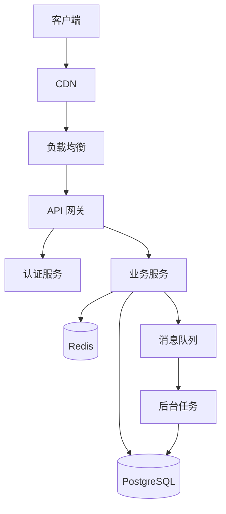

# 技术方案文档

**项目名称**: 开发一个待办事项应用
**创建时间**: 2026-03-17 19:54
**版本**: 1.0

---

## 1. 技术栈选择

### 1.1 后端技术

#### 编程语言
- **Python 3.11+**
- 理由：生态丰富、开发效率高、AI 支持好

#### Web 框架
- **FastAPI**
- 理由：高性能、异步支持、自动 API 文档

#### 数据库
- **PostgreSQL 15+**
- 理由：可靠性强、功能丰富、支持 JSON

### 1.2 前端技术

#### 框架
- **React 18+**
- 理由：生态成熟、组件丰富

#### UI 库
- **Ant Design / Tailwind CSS**
- 理由：组件齐全、样式美观

### 1.3 基础设施

#### 缓存
- **Redis**
- 理由：高性能、支持多种数据结构

#### 消息队列
- **RabbitMQ / Celery**
- 理由：异步任务处理

---

## 2. 系统架构图



---

## 3. 核心数据模型

### 3.1 用户表 (users)

```sql
CREATE TABLE users (
    id UUID PRIMARY KEY DEFAULT gen_random_uuid(),
    username VARCHAR(50) UNIQUE NOT NULL,
    email VARCHAR(100) UNIQUE NOT NULL,
    password_hash VARCHAR(255) NOT NULL,
    created_at TIMESTAMP DEFAULT CURRENT_TIMESTAMP,
    updated_at TIMESTAMP DEFAULT CURRENT_TIMESTAMP
);

CREATE INDEX idx_users_email ON users(email);
```

### 3.2 核心业务表

```sql
CREATE TABLE items (
    id UUID PRIMARY KEY DEFAULT gen_random_uuid(),
    user_id UUID REFERENCES users(id),
    title VARCHAR(200) NOT NULL,
    description TEXT,
    status VARCHAR(20) DEFAULT 'pending',
    created_at TIMESTAMP DEFAULT CURRENT_TIMESTAMP
);
```

---

## 4. API 设计

### 4.1 RESTful 规范

```
GET    /api/v1/items      # 获取列表
POST   /api/v1/items      # 创建项目
GET    /api/v1/items/:id  # 获取详情
PUT    /api/v1/items/:id  # 更新项目
DELETE /api/v1/items/:id  # 删除项目
```

### 4.2 响应格式

```json
{
  "success": true,
  "data": {},
  "message": "操作成功"
}
```

---

## 5. 部署架构

### 5.1 开发环境
- Docker Compose 本地运行
- 热重载开发模式

### 5.2 生产环境
- Docker 容器化部署
- Kubernetes 编排
- CI/CD 自动化

---

*生成时间：2026-03-17 19:54:44*
